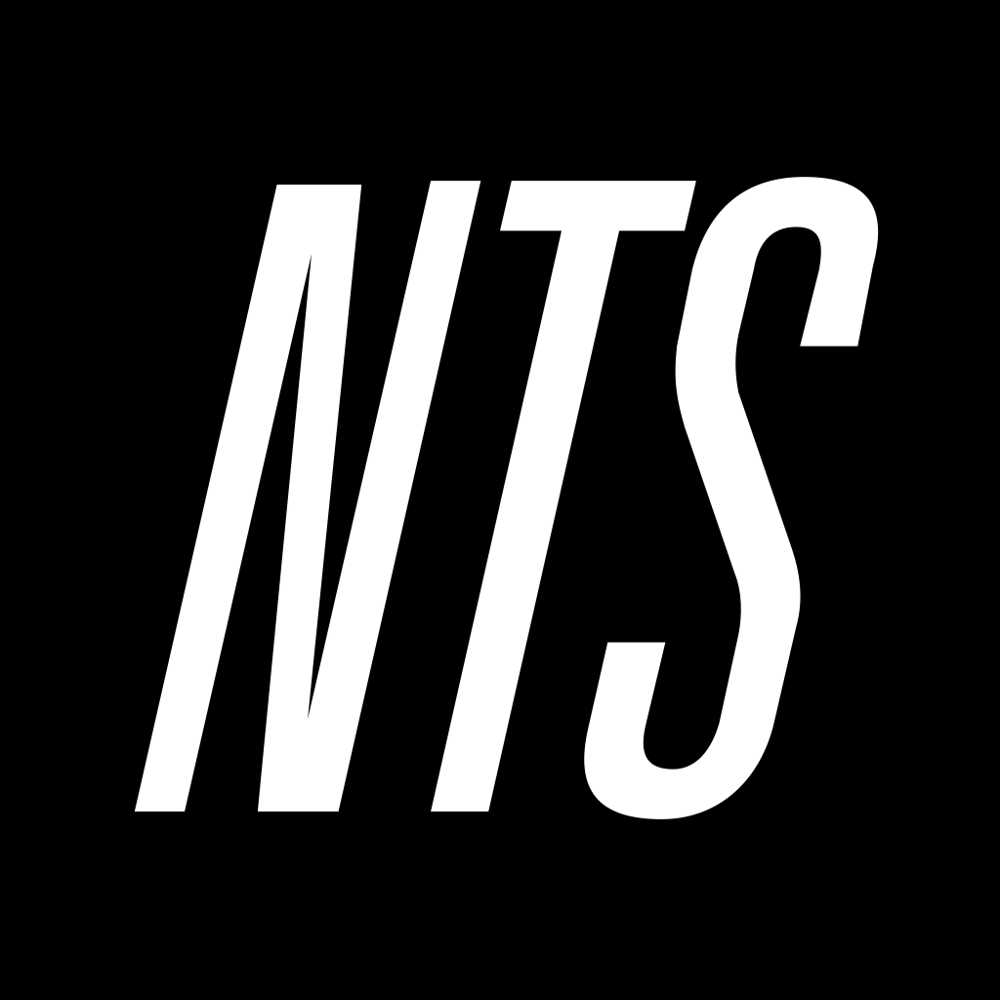

# NTS Desktop

An unofficial desktop player for [NTS Radio](https://www.nts.live/), built for
uninterrupted background listening on Windows and macOS.

Not affiliated with, endorsed by, or supported by NTS. Please do not report bugs
in this app to them.

## Download

Take the file for your machine from the
**[latest release](https://github.com/nicholaspjm/nts-desktop/releases/latest)**:

| File | For |
| --- | --- |
| `NTS-Desktop-Windows.exe` | Windows |
| `NTS-Desktop-Mac-Apple-Silicon.dmg` | Macs with an M1, M2, M3 or M4 chip |
| `NTS-Desktop-Mac-Intel.dmg` | Older Macs with an Intel chip |

Not sure which Mac you have? Click the Apple menu, then **About This Mac**. If
the Chip line says Apple M-anything, take the Apple Silicon one.

### Windows

Run the `.exe`. Windows shows a blue "Windows protected your PC" box because
the app is not code signed: click **More info**, then **Run anyway**. It installs
for your user only and never asks for an administrator password, then appears in
the Start Menu and Windows search as **NTS Desktop**.

### macOS

Open the `.dmg` and drag **NTS Desktop** to Applications, then open it. That is
the whole thing. The app is signed and notarised by Apple, so it launches like
anything else, with no warning and no Terminal.

Versions before 0.7.1 were not notarised and needed a command run against them
first. If you followed those instructions before, you can forget them.

### Building it yourself

Requires [Node](https://nodejs.org/) 20 or newer. `make` is not needed, and a
plain clone needs nothing but git.

```
git clone https://github.com/nicholaspjm/nts-desktop.git
cd nts-desktop
npx pnpm@10 install
npx pnpm@10 start
```

To produce an installer into `bundle/` for the machine you are on:

```
npx pnpm@10 exec electron-builder build --win --publish=never
npx pnpm@10 exec electron-builder build --mac --publish=never
```

Each platform's installer has to be built on that platform. Pushing a `v*.*.*`
tag builds both in CI and attaches them to the release.

### Signing, for whoever maintains this

A build with no credentials is ad-hoc signed, which is enough to launch but
makes macOS warn on first open. To sign and notarise properly, set these as
repository secrets under Settings, Secrets and variables, Actions:

| Secret | What it is | Where it comes from |
| --- | --- | --- |
| `MAC_CERT_P12` | Developer ID Application certificate, base64 | exported from Keychain Access |
| `MAC_CERT_PASSWORD` | the password set when exporting it | chosen at export time |
| `APPLE_API_KEY` | App Store Connect key file, base64 | App Store Connect, Integrations, Keys |
| `APPLE_API_KEY_ID` | that key's ID | shown next to the key |
| `APPLE_API_ISSUER` | the issuer ID | shown above the key list |

All five are optional and the build degrades rather than failing: without the
certificate it signs ad-hoc, and without the key it skips notarisation. A fork
with no secrets set still produces working installers, they just warn on first
launch.

Every release build verifies itself afterwards, reading the signing authority
back off the packaged app and asking Gatekeeper what it makes of the result. A
signed-but-unnotarised app is indistinguishable from a notarised one inside the
build, and only the second kind opens without a warning, so the build says which
it produced rather than leaving it to be discovered on someone's machine.

The certificate expires on 1 February 2027. Builds notarised before then keep
working afterwards, because the timestamp outlives the certificate, but new ones
will need a fresh one.

The Windows build is separate and still unsigned. Silencing SmartScreen needs
its own code-signing certificate, which is a different purchase.

## Origin

This is a fork of **[romeovs/nts-desktop](https://github.com/romeovs/nts-desktop)**
by Romeo Van Snick, MIT licensed. That project is a macOS menubar app, and this
fork began as a Windows port of it.

It has since diverged substantially: the menubar popup became a full window, and
live channels, Infinite Mixtapes, the schedule, archive search and playback,
stream diagnostics and output device selection were added. The original author's
work is the foundation, and the MIT licence and copyright are retained in
[LICENSE](./LICENSE).

## What it does

### Keeping the stream alive

This is the reason the app exists. The NTS streams are plain continuous
connections with no manifest, so when one drops the audio simply stops, often
without the browser raising an error at all.

- A watchdog that notices silence by watching playback position rather than
  waiting for an error that may never come
- Reconnects after ten seconds of a stalled clock, backing off from one second
  to thirty, varying the URL each time so a dead connection is not handed back
- Backoff resets the moment audio flows again, so an unrelated drop later
  recovers immediately
- Gives up only on sources that genuinely cannot be decoded, rather than
  retrying forever
- Reconnects instantly when the network returns instead of sitting out the
  backoff
- Plays through being minimised or in the background at full quality, with no
  throttling
- HLS delivery by default, which buffers 49 to 61 seconds against the direct
  stream's 1.7 to 2.3, so a stutter has to last a very long time to be audible.
  Both are the same 256kbps audio, and you can switch with the tradeoff
  explained in the app

### Listening

- Both live channels, with artwork, times, location, description, genre and
  mood tags
- All Infinite Mixtapes, with an optional AAC stream where NTS publishes one
- The full 18 slot schedule for both channels
- Archive search and playback, including pasting an `nts.live` show link
- Show and episode detail before you commit to playing
- Listening history
- Open on NTS, which opens whatever is playing on the site
- Hardware media key support
- A sleep timer that fades out rather than cutting
- Audio output device selection

### Knowing what you are hearing

- Bitrate, codec, sample rate and channel mode decoded from the audio itself,
  not taken on trust from the server's headers
- Both values shown side by side, so a server misreporting its own stream is
  visible rather than hidden
- A warning when the stream's sample rate does not match your output device,
  which means the system is resampling
- A buffer history graph marking every stall and reconnect
- Connection status throughout: connecting, playing, reconnecting or failed

### The window itself

- No OS title bar and no menu strip; everything lives behind one control
- Full screen now playing view
- Station switching from the bottom bar
- One palette across every screen, and no gradients

### Housekeeping

- Checks for updates by reading the releases redirect rather than the GitHub
  API, which allows only 60 unauthenticated requests an hour per address and so
  fails for everyone behind one office or carrier connection
- A crash log written to disk
- Problem reporting that opens the issues page
- Signed and notarised by Apple on macOS, so it opens with no warning
- Installs per user on Windows, with no administrator password

### What it deliberately does not do

- **Live tracklists.** These are an NTS Supporter feature, behind a config file
  that is encrypted in the upstream repository and cannot be obtained. No local
  build can ever show them.
- **Equalisation or level metering.** Analysing audio in the browser requires
  the stream to be requested in CORS mode, and the redirect NTS serves carries
  no header permitting that, so asking for it stops playback outright. This was
  tried three times and abandoned on evidence.
- **Windows code signing.** That needs its own certificate, so SmartScreen still
  shows a warning on first run.

## How this app gets its data, and the limits it keeps

NTS publishes no public API documentation. Everything here uses the same
endpoints the nts.live website calls from an ordinary browser session, found by
watching the site's own network requests. That makes it undocumented rather than
private, and it can change without notice. These are the rules this app holds
itself to.

### What it reads

| Purpose | Endpoint |
| --- | --- |
| Live now and schedule | `www.nts.live/api/v2/live` |
| Infinite Mixtapes | `www.nts.live/api/v2/mixtapes` |
| Archive search | `www.nts.live/api/v2/search` |
| A single archive show | `www.nts.live/api/v2/shows/…` |
| Audio | `stream-relay-geo.ntslive.net`, `stream-mixtape-geo.ntslive.net`, and the `radiomast.io` CDN they redirect to |

### The limits

**Only what a browser would fetch anyway.** Every request is one the website
itself makes. No endpoint is reached by guessing at internal or admin routes,
and nothing is accessed that a logged out visitor could not already load.

**No authentication, and no working around it.** The app signs into nothing. NTS
gates some features behind an NTS Supporter subscription, most visibly live
tracklists. Those stay gated: the app opens the real NTS page and asks you to
sign in there, rather than trying to reconstruct the data another way. When the
live stream's ICY metadata turned out to carry an empty track title, that was
reported as a gap rather than filled by scraping something else.

**Streams are played, never captured.** Audio is streamed for immediate
listening exactly as the website does. The app does not record, cache to disk,
re-host or redistribute any audio, and does not download archive shows. Archive
playback uses the same Mixcloud and SoundCloud players NTS embeds, so plays are
counted by those services as normal.

**Light on their servers.** Schedule polling is driven by when the current show
actually ends rather than a busy timer. Search is debounced so typing does not
fire a request per keystroke. The stream probe reads roughly 64 KB and then
aborts the connection instead of leaving a second audio stream open. Nothing is
crawled in bulk and no endpoint is polled in a tight loop.

**Their words and pictures stay theirs.** Show titles, descriptions, artwork and
tracklists are displayed as NTS serves them, attributed to NTS, and are not
altered or passed off as this project's own. Artwork is loaded from their CDN
rather than copied into this repository.

**Attribution and identity.** The app is clearly labelled unofficial. The NTS
name and logo identify the service it plays and imply no endorsement. The mark
in `logos/nts.svg` is taken from the NTS site header for that identification
only, and remains NTS's trademark.

### If NTS would rather this did not exist

This is a personal listening client, written because the browser player kept
dropping out. If anyone at NTS objects to any part of it, open an issue and it
will be changed or taken down.

## Licence

MIT, inherited from the upstream project. See [LICENSE](./LICENSE).

### Third party

Playback of the buffered live streams and the AAC mixtapes uses
[hls.js](https://github.com/video-dev/hls.js), Apache-2.0 licensed, which is
bundled into the installers. The remaining dependencies are listed in
`package.json`.
